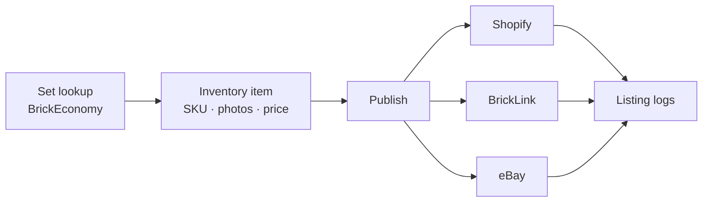
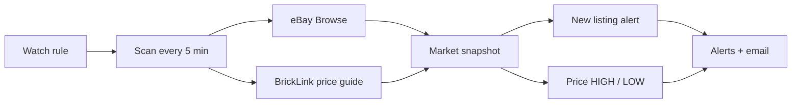
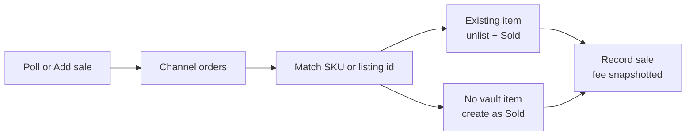
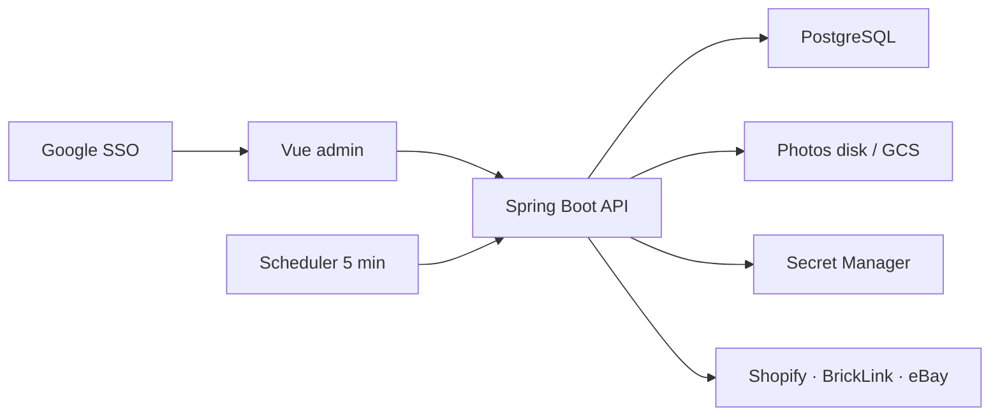

# Feature flows

Interactive Cursor canvas (open beside chat):

[`app-feature-flows.canvas.tsx`](./app-feature-flows.canvas.tsx)

Cursor only auto-loads canvases from its project `canvases/` folder. If this view is missing in the IDE, copy that file to:

`~/.cursor/projects/Users-USERNAME-Projects-the-timeless-vault/canvases/app-feature-flows.canvas.tsx`

The graphs below are the same four flows.

## List a set

## Market watch

## Sales

## System map

